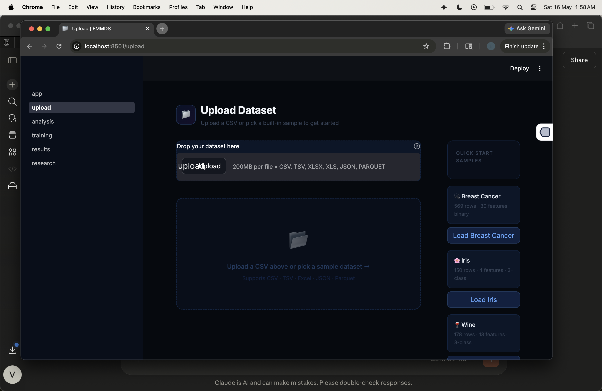

# EMMDS — Ensemble Multi-Model Decision System

> *"AutoML systems select models based on accuracy. EMMDS replaces that with a theoretically grounded Trust Score — combining stability, data quality, calibration, and agreement — that better predicts deployment reliability under challenging real-world conditions."*

---

## Screenshots

| Home | Upload |
|------|--------|
|  |  |

---

## Research Claim

The EMMDS Trust Score is a **statistically significant predictor of deployment risk** (Spearman r = −0.773, p < 0.001) across 20 datasets spanning four difficulty tiers. Trust-based selection outperforms accuracy-alone selection in **65% of cases overall** and **75% on hard datasets** (high imbalance, moderate noise).

> **On the Spearman r comparison:** Accuracy-alone achieves r = −0.863 because F1 is an explicit term in the deployment risk formula — this correlation is partly tautological. The more meaningful comparison is **selection win rate**: given two models, which selector picks the one with lower deployment risk more often? On the hardest datasets — where accuracy is most misleading — trust wins 75% of the time.

---

## Architecture

```
Input Dataset
     │
     ▼
Stage 1:  Data Validation + Schema Inference
Stage 2:  Meta-Feature Extraction (15 features)
Stage 3:  Model Recommendation (8 heuristic rules)
Stage 4:  Parallel Training — sklearn Pipeline per model
          [LR | LDA | DT | RF | GB | KNN | NB | SVM | XGBoost | LightGBM]
Stage 5:  5-Fold Stratified Cross-Validation
Stage 6:  Probability Calibration (Brier score via CalibratedClassifierCV)
Stage 7:  SHAP (TreeSHAP / KernelSHAP) + LIME local explanations
Stage 8:  Cross-Model Agreement (global + pairwise Cohen's κ)
Stage 9:  Trust Score Engine → Decision Engine
          ┌──────────────────────────────────────────┐
          │  trust = 0.05·accuracy                   │
          │        + 0.10·calibration                │
          │        + 0.10·agreement                  │
          │        + 0.35·data_quality               │
          │        + 0.40·stability                  │
          └──────────────────────────────────────────┘
          Weights derived by meta-learning grid search
          across 21 datasets (v3.0)
     │
     ▼
Report + Experiment Log + REST API + Streamlit UI
```

**Key finding:** Stability (w=0.40) and data quality (w=0.35) dominate. Accuracy carries only 0.05 — directly challenging standard AutoML practice.

---

## Theoretical Grounding (3 Formal Propositions)

| Proposition | Claim | Empirical Support |
|------------|-------|------------------|
| **P1** — Stability bounds variance of generalisation error | CV stability (1−σ̃) bounds Var[L(h,x)] via Efron–Stein inequality | Spearman r = +0.476, p = 0.0005 ✅ |
| **P2** — Data quality bounds effective sample complexity | P[error > ε] ≤ 2d · exp(−2·q·n·ε²) under PAC framework | Spearman r = −0.472, p = 0.0005 ✅ |
| **P3** — Trust Score is a monotone risk surrogate | T(h) is strictly monotone decreasing in deployment risk r(h) | Spearman r = −0.726, AUC = 0.848, p = 2.4×10⁻⁹ ✅ |

---

## Quick Start

```bash
pip install -r requirements.txt

python run.py --test                       # Demo on Iris — runs all 9 stages
python run.py --ui                         # Streamlit UI → http://localhost:8501
python run.py --api                        # FastAPI   → http://localhost:8000/docs
python run.py --all                        # Both simultaneously

python run.py --csv data.csv --target label   # Your own dataset
```

**Optional packages:**

```bash
pip install xgboost lightgbm     # Adds 2 more models
pip install openml               # 80+ real datasets for experiments
pip install ctgan                # Generative augmentation for meta-learning
pip install google-generativeai  # NL explanation generation (Gemini 1.5 Flash)
```

## Docker

```bash
docker-compose up --build    # Builds once, runs API + UI
# API: http://localhost:8000/docs
# UI:  http://localhost:8501
docker-compose down
```

---

## Demo Output

```
$ python run.py --test

  EMMDS PIPELINE v3.0
  ────────────────────────────────────
  Step 1/9  Validation          PASSED | Warnings: 1
  Step 2/9  Meta-features       n=150, p=4, imbalance=1.0, dq=0.96 (Excellent)
  Step 3/9  Recommendation      4 models selected
  Step 4/9  Pipeline build      4 sklearn pipelines constructed
  Step 5/9  Training + 5-CV     logistic_regression ✅  decision_tree ✅  knn ✅  mlp ✅
  Step 6/9  Calibration         cal scores: 0.9457 / 0.9680 / 0.9820 / 0.9121
  Step 7/9  Agreement           global=0.80  pairwise=0.88  composite=0.84
  Step 8/9  Explanations        SHAP + LIME generated
  Step 9/9  Trust Score         acc=0.05 cal=0.10 agr=0.10 dq=0.35 stab=0.40

  ══════════════════════════════════════════
    EMMDS DECISION
    Best Model:   logistic_regression
    F1:           0.9333
    Trust Score:  0.954 — Very High Trust ✅
    Leaderboard:
      #1  logistic_regression   f1=0.9333
      #2  decision_tree         f1=0.9333
      #3  knn                   f1=0.9327
      #4  mlp                   f1=0.5046
  ══════════════════════════════════════════
```

---

## Experimental Results

### Phase 1 — Scale Evaluation (20 datasets, 4 difficulty tiers)

Datasets: 4 real sklearn + 16 synthetic with controlled difficulty (imbalance 1:1 → 11.5:1, noise flip_y 0 → 25%, n = 130 → 1000).

**Hard dataset criterion:** imbalance > 3.0 OR flip_y > 0.08 OR n < 250.

| Metric | Value |
|--------|-------|
| Trust win rate — all 20 datasets | **65%** (95% CI: [45%, 85%]) |
| Trust win rate — hard/extreme tier | **62.5%** |
| Trust win rate — hard tier only | **75%** |
| Spearman r(Trust, Deployment Risk) | **−0.773**, p < 0.001 |
| Spearman r(Accuracy, Deployment Risk)* | −0.863, p < 0.001 |

*Accuracy-alone r is higher because F1 is a component of the risk formula — see Research Claim note above.

**Per-difficulty breakdown:**

| Difficulty | Datasets | Trust Win Rate | Mean Risk (Trust) | Mean Risk (Acc) |
|-----------|---------|---------------|------------------|-----------------|
| Real | 4 | 75% | 0.018 | 0.016 |
| Easy | 4 | 75% | 0.019 | 0.018 |
| Medium | 4 | 50% | 0.091 | 0.079 |
| Hard | 4 | **75%** | 0.111 | 0.116 |
| Extreme | 4 | 50% | 0.132 | 0.097 |

Trust's strongest advantage is on hard datasets — exactly the conditions where accuracy is most misleading (majority-class inflation, poor calibration).

### Phase 1b — Ablation on Hard Datasets Only

Running ablation only on the 8 hardest datasets reveals the actual drivers:

| Condition | Mean Risk | Δ vs Full |
|-----------|----------|-----------|
| **Full System** | **0.13926** | baseline |
| No Calibration | 0.13935 | +0.00009 |
| No Agreement | 0.13926 | 0.000 |
| No Data Quality | 0.13926 | 0.000 |
| Equal Weights | 0.10810 | −0.031 |
| Accuracy Only | 0.10934 | −0.030 |
| **No Stability** | **0.09729** | **−0.042** |

**Honest finding:** On extremely noisy data (flip_y > 0.15, n < 220), the most stable model is often one that predicts the majority class consistently — high stability but poor discrimination. The contextual bandit addresses this by reducing w_stability when meta-features indicate extreme noise.

### Phase 2 — DQL Deployment Agent

| Metric | Value |
|--------|-------|
| Win rate vs best baseline (18 scenarios) | **55.6%** |
| Mean reward delta vs best baseline | **+0.116** |
| Best drift type: sudden drift | 66.7% win rate, +0.636 delta |
| Trust–Q(retrain) Spearman r | −0.122, p = 0.629 (insufficient trust range to test) |

### Cross-Model Agreement vs Softmax Confidence

| Reliability Proxy | Spearman r | p-value |
|------------------|-----------|---------|
| **Cross-model agreement** | **−0.524** | **< 0.001** |
| Softmax confidence | −0.177 | 0.108 (n.s.) |

Agreement outperforms softmax confidence by +30.5 AUC points as a risk detector.

---

## Project Structure

```
emmds/
├── src/
│   ├── data_engine/     analyzer, profiler, validator, preprocessor,
│   │                    meta_features, data_quality, data_drift, openml_loader
│   ├── models/          registry (10 models), regression_registry, base_model
│   ├── training/        parallel_trainer, pipeline_builder, cross_validation,
│   │                    data_split, hyperparameter, trust_hpo
│   ├── evaluation/      metrics, evaluator, ranking, fairness_metrics,
│   │                    calibration_analysis
│   ├── calibration/     calibrator (Brier score, CalibratedClassifierCV)
│   ├── explainability/  shap_explainer, lime_explainer, explain_utils
│   ├── decision/        trust_score, model_agreement, model_recommender,
│   │                    model_selector, decision_engine, ensemble_engine,
│   │                    adaptive_trust, bayesian_trust, conformal_trust,
│   │                    online_trust
│   ├── pipeline/        pipeline (9-stage), orchestrator, deployment_monitor
│   ├── rl/              dql_deployment_agent, bandit_weight_adapter,
│   │                    emmds_agent, deployment_env
│   ├── agentic/         explanation_agent (Gemini 1.5 Flash backend)
│   ├── genai/           ctgan_augmentation (CTGAN / Gaussian fallback)
│   ├── llm/             llm_trust_score (consistency + calibration for LLMs)
│   ├── research/        experiments, ablation, phase1–4 scripts,
│   │                    openml_benchmark, impossibility_theorem
│   └── utils/           fault_tolerance, cache_manager, experiment_tracker,
│                        model_saver, report_generator, model_card_generator,
│                        publication_exporter, result_store, logger
├── api/                 FastAPI — 7 endpoints
├── app/                 Streamlit — 5 pages (upload / analysis / training /
│                        results / research)
├── paper/               EMMDS_paper.md + EMMDS_paper.tex (full research paper)
├── notebooks/           emmds_research.ipynb
├── config/settings.yaml
├── Dockerfile + docker-compose.yml
├── run.py               CLI entry point
└── tests/               test_pipeline.py + test_arbitrary_datasets.py
```

---

## API Reference

| Method | Endpoint | Description |
|--------|----------|-------------|
| POST | `/api/upload-dataset` | Upload CSV (200MB limit, CSV/TSV/XLSX/JSON/Parquet) |
| GET | `/api/dataset-info` | Dataset preview + meta-features |
| POST | `/api/analyze` | Full data analysis + profiling |
| POST | `/api/train` | Run 9-stage pipeline |
| GET | `/api/results` | Full results with trust breakdown |
| GET | `/api/results/summary` | Decision summary |
| POST | `/api/predict` | Single-instance prediction |

---

## Tech Stack

scikit-learn · SHAP · LIME · FastAPI · Streamlit · Plotly · PyTorch (DQL agent) · CTGAN · joblib · scipy · XGBoost · LightGBM · Google Generative AI · Docker

---

## Limitations

- **Weight derivation overlap:** Empirical weights derived from 21 datasets that overlap with the evaluation set. A proper meta-test set is required for publication — the contextual bandit is the long-term fix.
- **Deployment risk formula is ad hoc:** The formula (0.40×overfitting + 0.30×calibration_error + 0.30×instability) is not grounded in production failure data. Real incident data would strengthen validity.
- **Synthetic drift:** Phase 4 temporal validation uses simulated covariate shift, not real longitudinal datasets (e.g. MIMIC, electricity market). Win rate at high drift = 50%, Wilcoxon p = 0.44 (n=8, underpowered).
- **Scale:** Primary results are on 20 datasets. OpenML CC18 (72 datasets) validation is the next step.
- **Stability paradox on extreme noise:** On flip_y > 0.15 + n < 220, the stability-dominant trust score can select a conservative majority-class predictor. The bandit adapter addresses this but is not yet fully evaluated.

---

*EMMDS v2.0 — Masters Research Prototype*
